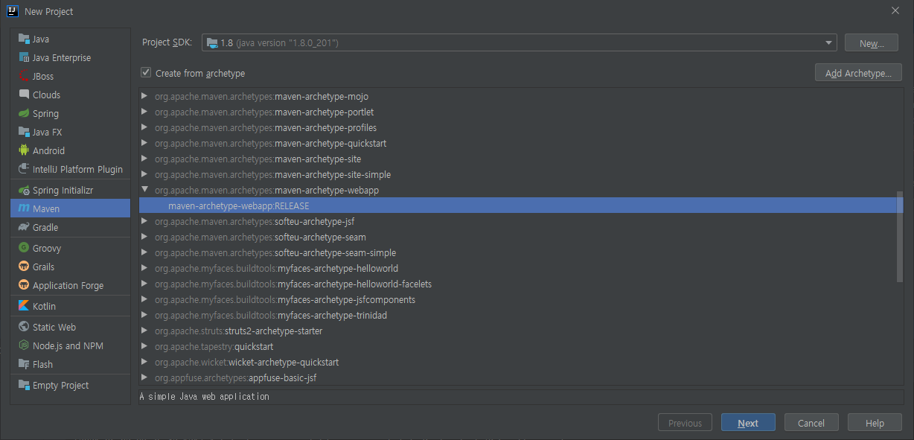

# spring.servlet.demo

# 서블릿 애플리케이션 개발

레거시 프로젝트를 생성해 봅니다.

앞으로 이 레거시 프로젝트에서부터 spring MVC 프로젝트로 변해갈것.

### 1. **플젝 생성**




### 2. maven repository 들어가서 java servlet 검색해서 소스 copy, pom.xml 에 paste.

```java
		<dependency>
      <groupId>junit</groupId>
      <artifactId>junit</artifactId>
      <version>4.11</version>
      <scope>test</scope>
    </dependency>

    <!-- https://mvnrepository.com/artifact/javax.servlet/javax.servlet-api -->
    <dependency>
      <groupId>javax.servlet</groupId>
      <artifactId>javax.servlet-api</artifactId>
      <version>4.0.1</version>
      <scope>provided</scope>      
    </dependency>

```

**scope**

이 의존성을 언제 어떻게 classpath에 넣고 쓸거냐

`provided` : 코딩하는 시점엔 쓸 수 있음. 런타임 시점, war 패키징할 땐 클래스패스에서 빠짐.

그럼 어디에서 제공되나? 컨테이너에서 제공됨.

`test` : 소스 클래스패스에선 사용 못함. 오로지 테스트를 실행할때만 쓸 수 있음

### 3. java 패키지 생성

src.main 밑에 java 패키지 생성한 후 프로젝트 스트럭쳐 - modules - Sources 들어가서 java 패키지를 sources로 mark

### 4. Java 파일 생성

java 패키지 밑에 me.hwpark 패키지 생성 후 HelloServlet 클래스 생성

```java
package me.hwpark;

// import 생략...

public class HelloServlet extends HttpServlet {
		// ctrl + o 눌러 override
    @Override
    public void init() throws ServletException {
        System.out.println("init");
    }

    @Override
    protected void doGet(HttpServletRequest req, HttpServletResponse resp) throws ServletException, IOException {
        System.out.println("doGet");
        resp.getWriter().println("<html>");
        resp.getWriter().println("<head>");
        resp.getWriter().println("<body>");
        resp.getWriter().println("<h1>test hwpark</h1>");
        resp.getWriter().println("</body>");
        resp.getWriter().println("</head>");
        resp.getWriter().println("</html>");
    }

    @Override
    public void destroy() {
        System.out.println("destroy");
    }

}
```

### 5. 서블릿 컨테이너에 배포


서블릿 독자적으로 우리가 실행할 수 있는 방법은 없음. 

실행은 톰캣이 필요하고, 서블릿 컨테이너에 배포하는 식으로 해야함. 

톰캣 다운 후 압축 풀면 됨.

그리고 오른쪽 하단의 빨간 느낌표 눌러서 war expploded 클릭.

**톰캣 사용 방법**

**윈도우**라면 톰캣 압축 풀기만 하면 끝.

**mac** 이라면 톰캣 압축푼 파일 bin안에 들어가서 쉘들에게 권한 주기. 그럼 sh파일 색이 다르게 나올것

```java
chmod +x ./*.sh
```

**[Server 탭]**
이 어플리케이션을 실행할 수 있는 서버는 9.0.14 버전이고

**[Deployed 탭]**

- javaservletdemo:war exploded
배포를 하는데 톰캣을 띄울때 자바서블릿데모란 애는 배포법이 2가지.
1. war로 묶어서 배포하는 방법
2. war를 압축을 풀어헤친 상태로 앱을 배포하는 방법도 있음. 지금은 후자(war exploded)
- Application context: /javaservletdemo_war_exploded
애플리케이션이 뜨는 위치 지정. /만 남기고 삭제.

### 6. web.xml 내용 추가

```java
<web-app>
  <display-name>Archetype Created Web Application</display-name>
	<!-- 여기서부터 추가 -->
  <servlet>
    <servlet-name>hello</servlet-name>
    <servlet-class>me.hwpark.HelloServlet</servlet-class>
  </servlet>

  <servlet-mapping>
    <servlet-name>hello</servlet-name>
    <url-pattern>/hello</url-pattern>
  </servlet-mapping>
</web-app>
```

### 6. 실행

**uri 들어가면?**

[http://localhost:8081/hello](http://localhost:8081/hello)
콘솔에 init, doGet 출력.

요청을 받고 서블릿이 처음 사용이 됨. 

서블릿 인스턴스를 만들고 라이프사이클에 따라 init 메서드가 호출됨. 그래서 콘솔이 찍힌것.

그다음엔 get요청도 처리해야하니 doGet이 호출되고 html이 보인것.

**한번더 uri를 새로고침하면?**

콘솔에 doGet만 출력

서블릿은 이미 한번 메모리에 로딩되면서 초기화가 됐기 때문에 다시는 init을 호출하지 않음.

**서블릿 컨테이너를 종료하면**

(tomcat) destroy가 호출됨.

우리가 학습할 spring mvc는 httpServlet 기반으로 만들어졌다.

- 어노테이션으로 어떻게 처리를 했을까.
- 어떻게 web.xml을 만들지도 않고 웹앱을 잘 띄울 수 있었을까.
- spring mvc도 서블릿이었고 그런데 왜web.xml에 등록하지 않아도 됐을까

앞으로 이런 궁금증을 해결해 줄것
